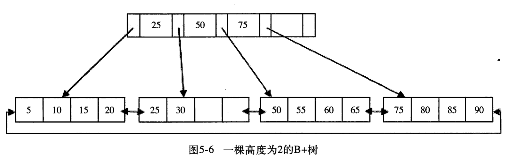
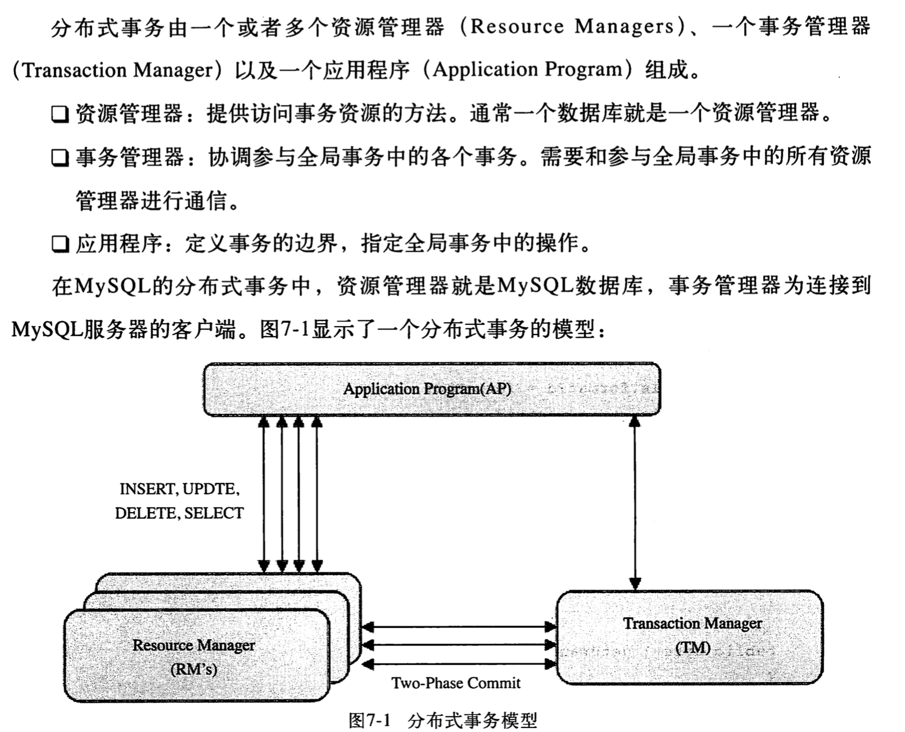

#### innodb引擎内幕


##### 检查引擎使用情况

`show engine innodb status;` -- 引擎的使用状态

还可以通过 `information_schema`库下的`INNODB_TRX`,`INNODB_LOCKS`,`INNODB_LOCK_WAITS` 三张表，可以简单的分析当前的事务并分析可能存在的锁的问题。

##### 慢查询

`mysqldump **slow.log`

在mysql库中有一个`slow_log`表记录了慢查询

##### 二进制日志

`show variables like 'datadir'` 查看二进制日志(bin_log)路径

##### mysql分区表

分区功能并不是在存储引擎完成的，因此并不只有INNODB支持分区，常见的存储引擎，
不论创建何种类型的分区，如果表中存在主键或唯一索引时，分区列必须是索引的一个组成部分。

**RANGE分区**
> 数据基于属于一个给定的连续区间的列值放入分区。可以让数据按照ID分区和日期分区
```sql
alter table tname
	PARTITION by RANGE(id)(
	PARTITION p0 values less than(20),
	PARTITION p1 values less than(40),
	PARTITION pm VALUES LESS THAN(MAXVALUE)
);

```

```sql
alter table tname
	PARTITION by RANGE(YEAR(date))(
	PARTITION p2008 values less than(2009),
	PARTITION pm VALUES LESS THAN(MAXVALUE)
);
```

创建日期分区表的好处
1. 是便于对表的管理，如需要删除2008年的数据就只需要删除相应的分区就行。 `alter table tname drop partition p2008`
2. 加速某些查询 ` select * from tname where date > '2008-01-01' and date < '2008-12-28' `;
3. 需要注意的是 RANGE分区的查询，优化器只会对`YEAR()`、`TO_DAYS()`、`TO_SECONDS()`、`UNIX_TIMESTAMP()`这类函数进行优化选择。


<strong>LIST分区</strong>
> list分区和range分区类似，只是list分区面向的是离散的值。
```sql
alter table tname
	PARTITION by LIST(id)(
	PARTITION p0 values in(1,2,3),
	PARTITION p1 values in (4,5,6)
);
```

**HASH分区**
> 根据用户自定义的表达式的返回值来进行分区，返回值不能是负数。哈希分区是的目的是将数据均匀的分不到预先定义的各个分区中，保证各个分区中的数据数量大致都是一样的
```sql
create table tname (
	id int PRIMARY KEY AUTO_INCREMENT,
	name varchar(20)
	)
	PARTITION by HASH (id)
	partitions 3;
```


**KEY分区**
> 根据mysql数据库提供的哈希函数来进行分区。

##### B+树

B指的是balance 平衡树，B+树的演进 `二叉树-->平衡二叉树-->B树-->B+树`
> B+树是为磁盘或其他直接存取辅助设备而设计的一种平衡查找树。在B+树中所有记录节点都是按键值的大小顺序存放在同一层的叶子节点中，各个叶子节点指针进行链接

如下面的B+树高度是2，每页可存放4条记录，扇出(fan out)为5


B+树在数据库中有一个特点就是高扇出性，因此在数据库中B+树一般高度都在2-3层，也就是查找某一键值的行记录，最多需要2-3次io.

数据库中B+树索引可以分为聚集索引(clustered index)和非聚集索引(secondary index)


##### INNODB存储引擎中的锁

1. 共享锁 S LOCK
> 允许事物读一行数据

2. 排他锁 X LOCK
> 允许事物删除或更新一行数据

**锁的算法**  

INNODB中有3中行锁的算法设计，分别是
1. Record Lock: 单个行记录上的锁。
2. Gap Lock: 间隙锁，锁定一个范围但是不包含记录本身。
3. Next-Key Lock: Gap Lock + Record Lock 锁定一个范围，并且锁定记录本身。  

INNODB存储引擎默认的事务隔离级别是`REPEATABLE READ` 但是通过`Next-Key Lock`算法可以避免`不可重复读`

事务的ACID: `原子性`、`一致性`、`隔离性`、`持久性`。

事务的隔离级别：`read uncommited`,`read commited`,`repeatable read`,`serialiable`

##### mysql中的分布式事务

> 分布式事务：多个独立的事务资源参与一个全局的事务中，事务资源通常是关系型数据库，但也可以是其他类型的资源，全局事务要求在其中所有参与的事务要么都提交，要么都回滚，这对于事务原有的ACID要求又有了提高。

INNODB存储引擎支持XA事务，通过XA事务可以来支持分布式事务的实现。<span style="color=red">在使用分布式事务时，INNODB引擎的事务隔离级别必须设置成`SERIALIABLE`</span>

下面是分布式事务模型
  

分布式事务使用两段式提交
1. 第一阶段：所有参与全局事务的节点都开始准备，告诉事务管理器他们准备好提交了
2. 第二阶段：事务管理器告诉资源管理器执行 ROLLBACK还是COMMIT，如果任何一个节点显示不能提交，则所有的节点都被告知需要回滚

##### mysql备份

逻辑备份 ： `mysqldump --databases db1 > dump.sql`，恢复：`mysql -uroot -p < dump.sql`，也可以通过`source`命令，`load data infile`、`mysqlimport`

同样也可以使用`select [column1]、[column2] INTO OUTFILE 'filename'`,filename表示所导出的文件，但是文件路径必须是`mysql:mysql`权限。

**二进制文件的备份和恢复**  
推荐的配置是
```sql
log-bin
sync_logbin = 1
innodb_support_xa = 1

```
备份日志前可以通过`flush logs` 命令来生成一个新的二进制日志文件。
恢复二进制日志也是非常简单，通过`mysqlbinlog`即可。 `mysqlbinlog [option] log_file`  
恢复一个binlog文件  `shell>mysqlbinlog binlog.001 | mysql -uroot -p test`
恢复多个文件 `shell>mysqlbinlog binlog.[0-10]* | mysql -uroot -p test`
指定偏移量来恢复 `shell>mysqlbinlog --start-position=10075  binlog.001 | mysql -uroot -p test`

**热备**

`ibbackup`是innodb引擎官方提供的热备工具
优点：
1. 在线备份。不阻塞任何SQL语句。
2. 备份性能好。备份的实质是复制数据库文件和重做日志文件
3. 支持压缩。通过参数支持不通级别的压缩
4. 跨平台。

`XtraBackup`