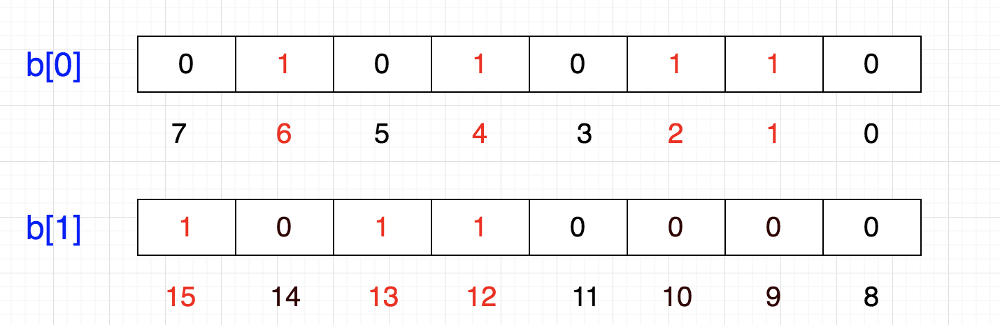
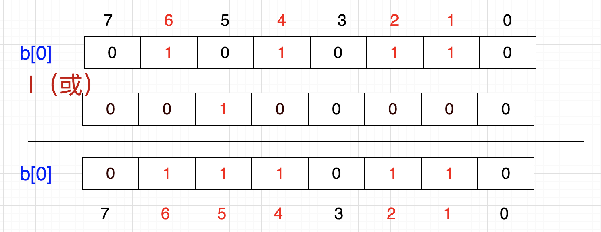

### bitmap 

bitmap的基本思想就是使用bit位来表示某个元素对应的值，由于采用bit为单位来存储数据，所以存储空间会大大节省。

在java中一个int类型是4byte = 32bit

假如我们用int存储1亿个数字，占用空间约为：

100000000 * 4 / 1024 / 1024 ≈ 381.5 M

如果使用bit来存储，占用空间约为：

100000000 / 8 / 1024 / 1024 ≈ 11.9 M

可见 **存储空间大大缩减**

具体思路：

bit的每一位表示一个数字，那么我们需要怎么表示（1，2，4，6）这几个数字呢

  
那么我们怎么存储（12，13，15）呢，当然是在另外8位上了  
  

这样我们就可以用一个数组存储已知数量的数字。  
一个int占32位，那么我们只需要申请一个int数组 ** int sz[1 + N/32]** 即可存储，其中N表示要存储的这些数字中的最大值  

相当于
sz[0]：可以表示0~31

sz[1]：可以表示32~63

sz[2]：可以表示64~95 等

如此一来，给定任意整数M，那么M/32就得到下标，M%32就知道它在此下标的哪个位置

#### 添加  

想把5这个数字放进去，怎么做呢？ 首先，5/32 = 0，5%32 = 5，也是说它应该在sz[0]的第5个位置，那我们把1向左移动5位，然后按位**或**  
  
位中原来就存储了1，2，4，6  
这就相当于 86 | 32 = 118， 86 | (1<<5) = 118  
也就是说，要想插入一个数，将1左移带代表该数字的那一位，然后与原数进行按位或操作

化简一下，就是 86 + (5/8) | (1<<(5%8))

因此，公式可以概括为：p + (i/8)|(1<<(i%8)) 其中，p表示现在的值，i表示待插入的数