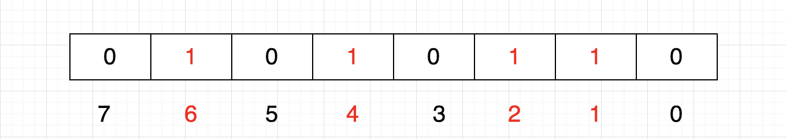

## bitmap 

bitmap的基本思想就是使用bit位来表示某个元素对应的值，由于采用bit为单位来存储数据，所以存储空间会大大节省。

在java中一个int类型是4byte = 32bit

假如我们用int存储1亿个数字，占用空间约为：

100000000 * 4 / 1024 / 1024 ≈ 381.5 M

如果使用bit来存储，占用空间约为：

100000000 / 8 / 1024 / 1024 ≈ 11.9 M

可见 **存储空间大大缩减**

具体思路：

bit的每一位表示一个数字，那么我们需要怎么表示（1，2，4，6）这几个数字呢

  
那么我们怎么存储（12，13，15）呢，当然是在另外8位上了  
  

这样我们就可以用一个数组存储已知数量的数字。  
一个int占32位，那么我们只需要申请一个int数组 ** int sz[1 + N/32]** 即可存储，其中N表示要存储的这些数字中的最大值  

相当于
sz[0]：可以表示0~31

sz[1]：可以表示32~63

sz[2]：可以表示64~95 等

如此一来，给定任意整数M，那么M/32就得到下标，M%32就知道它在此下标的哪个位置

### 添加  

想把5这个数字放进去，怎么做呢？ 首先，5/32 = 0，5%32 = 5，也是说它应该在sz[0]的第5个位置，那我们把1向左移动5位，然后按位**或**  
  
位中原来就存储了1，2，4，6  
这就相当于 86 | 32 = 118， 86 | (1<<5) = 118  
也就是说，要想插入一个数，将1左移带代表该数字的那一位，然后与原数进行按位或操作

化简一下，就是 86 + (5/8) | (1<<(5%8))

因此，公式可以概括为：p + (i/8)|(1<<(i%8)) 其中，p表示现在的值，i表示待插入的数  

### 清除  

假设我们要6移除  
  
位中原来有1，2，4，6  
从图上看，只需将该数所在的位置为0即可

1左移6位，就到达6这个数字所代表的位，然后按位取反，最后与原数按位与，这样就把该位置为0了。  
b[0] = b[0] & (~(1<<6))

b[0] = b[0] & (~(1<<(i%8)))  

### 查找  
前面我们也说了，每一位代表一个数字，1表示有（或者说存在），0表示无（或者说不存在）。通过把该为置为1或者0来达到添加和清除的小伙，那么判断一个数存不存在就是判断该数所在的位是0还是1 假设，我们想知道3在不在，那么只需判断 b[0] & (1<<3) 如果这个值是0，则不存在，如果是1，就表示存在

### 代码展示

可以根据上面的思想自己实现，我这边是没有自己实现copy网络上的实现。  

```java

public class BitMap {

  private long length;
  private static int[] bitsMap;
  private static final int[] BIT_VALUE = {0x00000001, 0x00000002, 0x00000004, 0x00000008, 0x00000010, 0x00000020,
          0x00000040, 0x00000080, 0x00000100, 0x00000200, 0x00000400, 0x00000800, 0x00001000, 0x00002000, 0x00004000,
          0x00008000, 0x00010000, 0x00020000, 0x00040000, 0x00080000, 0x00100000, 0x00200000, 0x00400000, 0x00800000,
          0x01000000, 0x02000000, 0x04000000, 0x08000000, 0x10000000, 0x20000000, 0x40000000, 0x80000000};

  public BitMap(long length) {
    this.length = length;
    /**
     * 根据长度算出，所需数组大小
     * 当 length%32=0 时大小等于
     * = length/32
     * 当 length%32>0 时大小等于
     * = length/32+1
     */
    bitsMap = new int[(int) (length >> 5) + ((length & 31) > 0 ? 1 : 0)];
  }

  /**
   * @param n 要被设置的值为n
   */
  public void setN(long n) {
    if (n < 0 || n > length) {
      throw new IllegalArgumentException("length value "+n+" is  illegal!");
    }
    // 求出该n所在bitMap的下标,等价于"n/5"
    int index = (int) n>>5;
    // 求出该值的偏移量(求余),等价于"n%31"
    int offset = (int) n & 31;
    /**
     * 等价于
     * int bits = bitsMap[index];
     * bitsMap[index]=bits| BIT_VALUE[offset];
     * 例如,n=3时,设置byte第4个位置为1 （从0开始计数，bitsMap[0]可代表的数为：0~31，从左到右每一个bit位表示一位数）
     * bitsMap[0]=00000000 00000000 00000000 00000000  |  00000000 00000000 00000000 00001000=00000000 00000000 00000000 00000000 00001000
     * 即: bitsMap[0]= 0 | 0x00000008 = 3
     *
     * 例如,n=4时,设置byte第5个位置为1
     * bitsMap[0]=00000000 00000000 00000000 00001000  |  00000000 00000000 00000000 00010000=00000000 00000000 00000000 00000000 00011000
     * 即: bitsMap[0]=3 | 0x00000010 = 12
     */
    bitsMap[index] |= BIT_VALUE[offset];

  }
  /**
   * 获取值N是否存在
   * @return 1：存在，0：不存在
   */
  public int isExist(long n) {
    if (n < 0 || n > length) {
      throw new IllegalArgumentException("length value illegal!");
    }
    int index = (int) n>>5;
    int offset = (int) n & 31;
    int bits = (int) bitsMap[index];
    // System.out.println("n="+n+",index="+index+",offset="+offset+",bits="+Integer.toBinaryString(bitsMap[index]));
    return ((bits & BIT_VALUE[offset])) >>> offset;
  }
}
```  

### bitmap的作用  

大量数据的快速排序、查找、去重

#### 快速排序

假设我们要对0-7内的5个元素(4,7,2,5,3)排序（这里假设这些元素没有重复）,我们就可以采用Bit-map的方法来达到排序的目的。

要表示8个数，我们就只需要8个Bit（1Bytes），首先我们开辟1Byte的空间，将这些空间的所有Bit位都置为0，然后将对应位置为1。

最后，遍历一遍Bit区域，将该位是一的位的编号输出（2，3，4，5，7），这样就达到了排序的目的，时间复杂度O(n)。

##### 优点：

运算效率高，不需要进行比较和移位；
占用内存少，比如N=10000000；只需占用内存为N/8=1250000Byte=1.25M  
##### 缺点：

所有的数据不能重复。即不可对重复的数据进行排序和查找。
只有当数据比较密集时才有优势  
#### 快速去重

20亿个整数中找出不重复的整数的个数，内存不足以容纳这20亿个整数。 

首先，根据“内存空间不足以容纳这05亿个整数”我们可以快速的联想到Bit-map。下边关键的问题就是怎么设计我们的Bit-map来表示这20亿个数字的状态了。其实这个问题很简单，一个数字的状态只有三种，分别为不存在，只有一个，有重复。因此，我们只需要2bits就可以对一个数字的状态进行存储了，假设我们设定一个数字不存在为00，存在一次01，存在两次及其以上为11。那我们大概需要存储空间2G左右。

接下来的任务就是把这20亿个数字放进去（存储），如果对应的状态位为00，则将其变为01，表示存在一次；如果对应的状态位为01，则将其变为11，表示已经有一个了，即出现多次；如果为11，则对应的状态位保持不变，仍表示出现多次。

最后，统计状态位为01的个数，就得到了不重复的数字个数，时间复杂度为O(n)。

#### 快速查找

这就是我们前面所说的了，int数组中的一个元素是4字节占32位，那么除以32就知道元素的下标，对32求余数（%32）就知道它在哪一位，如果该位是1，则表示存在。  

有了上面的思想铺垫我们就可以引入 **BloomFilter**

BloomFilter工作流程：

首先需要 k 个 hash 函数，每个函数可以把 key 散列成为 1 个整数；  
初始化时，需要一个长度为 n 比特的数组，每个比特位初始化为 0；  
某个 key 加入集合时，用 k 个 hash 函数计算出 k 个散列值，并把数组中对应的比特位置为 1；  
判断某个 key 是否在集合时，用 k 个 hash 函数计算出 k 个散列值，并查询数组中对应的比特位，如果所有的比特位都是1，认为在集合中。

  

google 的guava中有bloomfilter的实现可以引入工程使用  
```text
 <dependency>
     <groupId>com.google.guava</groupId>
     <artifactId>guava</artifactId>
     <version>28.1-jre</version>
 </dependenc
```  