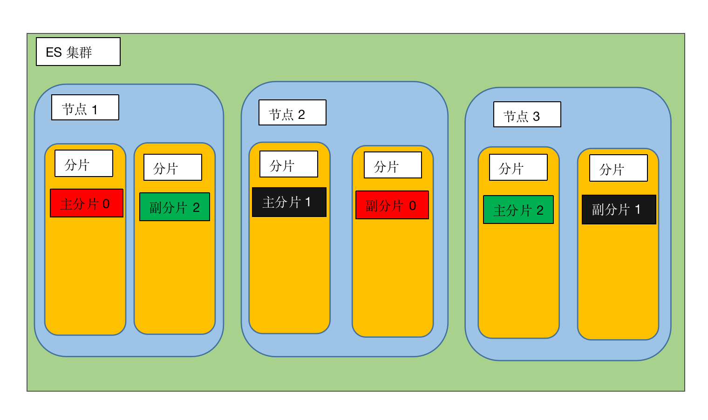

### 分片

分片概念介绍：

区别于节点概念，当我们创建一个文档的时候，文档会被存储在一个主分片中，`elasticsearch`如何知道是一个文档放在那个分片中呢？首先这肯定不是随机的，否则将来就查询不到了。是根据下面这个公式

`shard = hash(routing) % number_of_primary_shards`

routing 是一个可变值，默认是文档的 _id ，也可以设置成一个自定义的值。routing 通过 hash 函数生成一个数字，然后这个数字再除以 number_of_primary_shards （主分片的数量）后得到 余数 。这个分布在 0 到 number_of_primary_shards-1 之间的余数，就是我们所寻求的文档所在分片的位置。这也就是在创建`index`的时候确定好主分片的数量，并且永远不会改变这个数量的原因。

每一个分片都是一个Lucene实例


#### 数据流向

接下来看一下我们执行增删改查时，请求和数据在节点见的流向

> 新建数据 流程

假设我们现在有3个节点，两个主分片，每个主分片有两个副本


1. 客户端向 Node 1 发送新建、索引或者删除请求。

2. 节点使用文档的 _id 确定文档属于分片 0 。请求会被转发到 `Node 3`，因为分片 0 的主分片目前被分配在 `Node 3 上。

3. Node 3 在主分片上面执行请求。如果成功了，它将请求并行转发到 Node 1 和 Node 2 的副本分片上。一旦所有的副本分片都报告成功, Node 3 将向协调节点报告成功，协调节点向客户端报告成功。

> 查询文档 流程

以下是从主分片或者副本分片检索文档的步骤顺序：


1. 客户端向 Node 1 发送获取请求。

2. 节点使用文档的 _id 来确定文档属于分片 0 。分片 0 的副本分片存在于所有的三个节点上。 在这种情况下，它将请求转发到 Node 2 。

3. Node 2 将文档返回给 Node 1 ，然后将文档返回给客户端。

在处理读取请求时，协调结点在每次请求的时候都会通过轮询所有的副本分片来达到负载均衡。


设置主分片数量和每个主分片的副本数量，这里设置了主分片数量是3，每个主分片还有一个副本分片
```text
PUT /blogs
{
   "settings" : {
      "number_of_shards" : 3,
      "number_of_replicas" : 1
   }
}
```
假设有三个节点上面设置可看成下图

