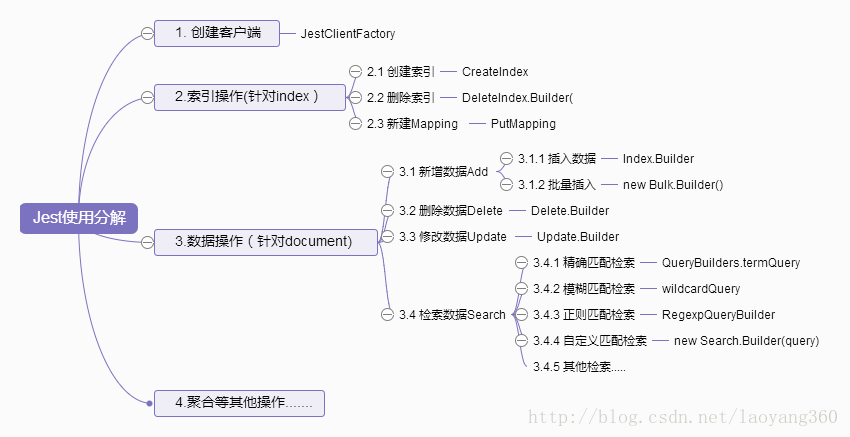

### 项目中使用ES

#### 1. TransportClient

高版本不建议使用，8.x将被删除

#### 2. RestClient

没有提供增删改差方法，只能自己写json并选择Http请求的方法进行实现，一般使用较少

#### 3. RestHighLevelClient

高级相对第二个而言的。提供了一些增删改查的方法

#### 4. Jest



#### 5. Spring Data Elasticsearch

引入

```text
<dependency>
    <groupId>org.springframework.boot</groupId>
    <artifactId>spring-boot-starter-data-elasticsearch</artifactId>
</dependency>
```

#### 6. 用http请求直连

这就到了如何封装http了