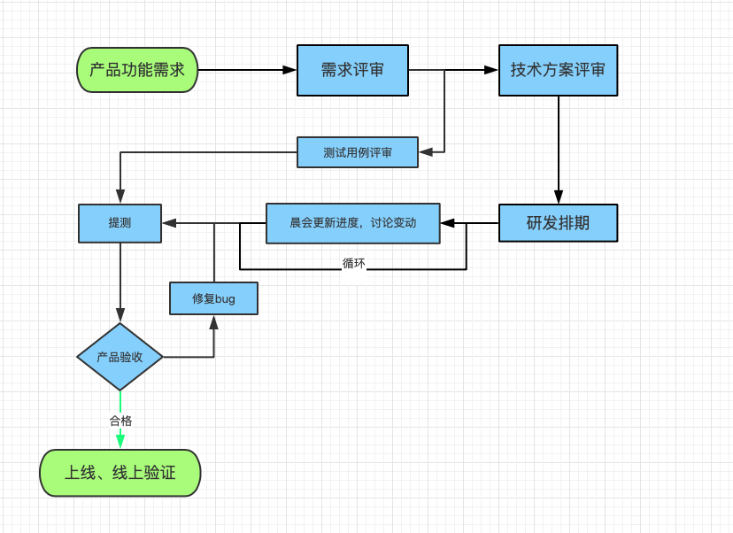
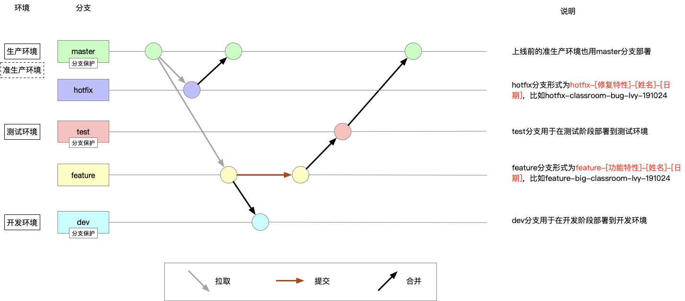

### 流程

#### 研发  

**需求评审：**参与者是产品、开发、测试，并且开发需要提前看需求文档记录不清楚的地方，没有需求文档可以不给做。  
**技术方案评审：**参与者是开发人员，主要评估技术实现方案，为研发排期做基础。  
**测试用例评审：**参与者是产品开发测试，测试主导会议主要评估测试点是否全部覆盖等。  
**研发排期：**参与者是产品、开发、测试。这一步可以合并在晨会中。  定的日期需要记录在需求文档或者`trello`、`禅道`等团队协作工具。  
**晨会：**参与者是产品、开发、测试，主要是更新进度，讨论开发中遇见等问题、技术方案的变动、需求的变动，记录都要记录在需求文档中体现，并且在必要时需要有邮件记录，邮件发送人是晨会的主持。

#### 分支管理  
  

**feature：**这个是开发产品想要的功能的分支，基于`master`创建，每个人都有自己的分支，一个人会有多个分支，能满足并行开发的需求。  
**hotfix：**这个是线上有重大事件的紧急修复，修复之后合并到master，再之后每个人需要重新拉取一下master的代码，确保是最新的代码。
**test环境：**专门给测试人员使用。  
**dev环境：**给开发人员用。feature合并到dev这步操作需要有merge request，并且有code review，并且merge操作必须是非本人。  
#### 重大事故复盘  

出现重大事故及时复盘，发现流程隐患推动流程的完善。