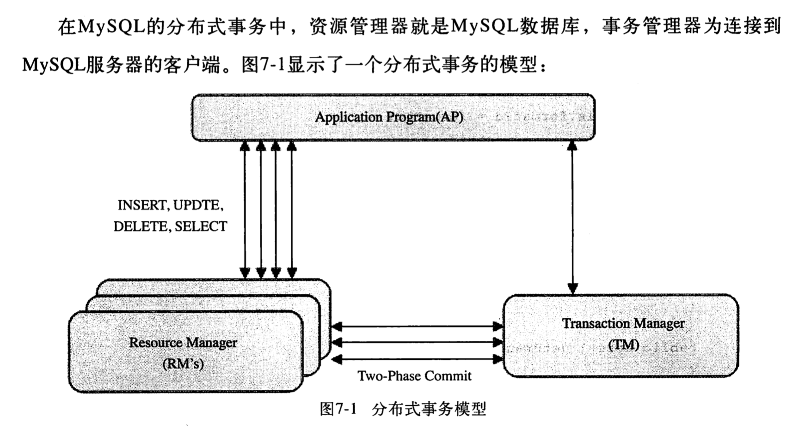

### 一致性协议    

脑裂：  

#### 2PC  

```text
2PC Two-Phase Commit 即二阶段提交，是计算机网络，尤其是在数据库领域，为了使基于分布式系统架构下的所有节点在进行事务处理过程中能够保持原子性和一致性而设计的一种算法。
```
  

阶段一：提交事务请求  
1. 事务询问  
    协调者向所有参与者发送事务内容，询问是否可以执行事务提交操作，并开始等待参与者的响应。  
2. 执行事务  
    参与者节点执行事务操作，并将Undo和Redo信息记入事务日志中。  
3. 各个参与者向协调者反馈事务询问的相应  
    参与者成功执行事务，反馈给协调者Yes响应，如果没有成功执行事务，那么就反馈No,标示事务不可执行。  

阶段二：执行事务提交  
有两种可能  
1. 反馈Yes，执行事务提交  
    <ul>
        <li>发送提交请求：</li> 向所有节点发出commit请求
        <li>事务提交：</li> 参与者收到commit请求，正式执行事务提交操作，并在完成提交之后释放在整个事务执行期间占用的事务资源
        <li>反馈事务提交结果：</li> 参与者在完成事务提交之后，向协调者发送Ack消息。
        <li>完成事务：</li> 协调者收到Ack后，完成事务。
    </ul>
2. 反馈No，中断事务  
    <ul>
        <li>发送回滚请求：</li> 向所有节点发出Rollback请求
        <li>事务回滚：</li> 参与者收到Rollback请求，会利用其在阶段一中记录的Undo信息来执行事务回滚操作并在回滚完成之后释放在整个事务执行期间占用的事务资源
        <li>反馈事务回滚结果：</li> 参与者在完成事务回滚之后，向协调者发送Ack消息。
        <li>中断事务：</li> 协调者收到Ack后，完成事务中断。
    </ul>

简单的讲：二阶段提交是将一个事务的处理过程分成来投票和执行两个阶段，其核心是对每个事务都采用先尝试后提交的处理方法，因此也可以将二阶段提交看作是强一致性的算法。  
优缺点：  
优点：原理简单，实现方便。  
缺点：同步阻塞、单点问题(协调者)、脑裂、保守  
    同步阻塞：在二阶段提交执行过程中，所有参与该事务操作的逻辑都处于阻塞状态，也就是说，各个参与者在等待其他参与者响应的过程中，将无法进行其他任何操作。    
    单点问题：协调者在整个过程都起这非常重要都作用，一旦协调者出现问题这个流程都会无法运转，如果协调者在阶段二出现问题，那么其他参与者将会一直处于锁定事务资源的状态中，无法继续完成事务操作。    
    数据不一致： 执行事务提交的时候，当协调者向所有的参与者发送commit请求之后，发生了局部网络异常或者是协调者尚未发送完commit请求之前自身崩溃，导致最终只有部分参与者收到commit请求，于是这部分收到请求的参与者执行事务的提交，而没有收到commit请求的参与者则无法进行事务提交，于是整个分布式系统便出现了数据不一致的问题。

#### 3PC  

#### Paxos算法  
```text
该算法是`莱斯利.兰伯特`于1990年提出的一种基于消息传递且具有高度容错特性的一致性算法，是目前公认的解决分布式一致性问题最有效的算法之一。
```

